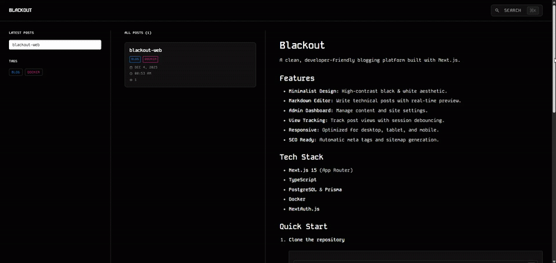

# Blackout

A clean, developer-friendly blogging platform built with Next.js.

## Features

*   **Minimalist Design**: High-contrast black & white aesthetic.
*   **Markdown Editor**: Write technical posts with real-time preview.
*   **Admin Dashboard**: Manage content and site settings.
*   **View Tracking**: Track post views with session debouncing.
*   **Responsive**: Optimized for desktop, tablet, and mobile.
*   **SEO Ready**: Automatic meta tags and sitemap generation.

## Preview



## Tech Stack

*   **Next.js 15** (App Router)
*   **TypeScript**
*   **PostgreSQL** & **Prisma**
*   **Docker**
*   **NextAuth.js**

## Quick Start

1.  **Clone the repository**
    ```bash
    git clone https://github.com/rrrainielll/blackout-web.git
    cd blackout
    ```

2.  **Setup Environment**
    Create a `.env` file (see `env.example` or use the template below):
    ```env
    POSTGRES_USER=postgres
    POSTGRES_PASSWORD=password
    POSTGRES_DB=blackout
    NEXTAUTH_SECRET=your_secret
    NEXTAUTH_URL=http://localhost:3000
    # For npm testing ensure that the progress docker is running.
    DATABASE_URL=postgresql://postgres:password@db:5432/blackout?schema=public
    ```


3.  **Run with Docker**
    ```bash
    docker-compose up --build -d
    ```
    Access the app at `http://localhost:3000`.

## Database Commands

*   **Push Schema**: `npx prisma db push`
*   **View Data**: `npx prisma studio`

## SMTP Configuration

SMTP settings are now managed directly within the **Admin Dashboard** under the "SMTP Settings" section. You do not need to configure them in the `.env` file.


## Credits

Developed using **Vibe Coding**, and meticulously reviewed by **Rainiel Montañez**, leveraging **Claude Sonnet 4.5 Thinking**, **Claude Sonnet 4.5**, **Gemini Pro**, and **ChatGPT** for insights and enhancements.

If you have any questions or suggestions, feel free to [email me](mailto:rainielmontanez@dex-server.space) or open an [issue on GitHub](https://github.com/rrrainielll/blackout-web/issues).
